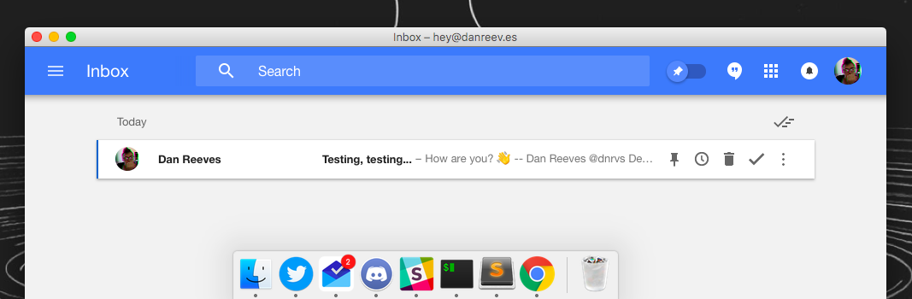

# Google Inbox Fluid Userscript

Gives you a multiuser (across tabs) unread count on the dock.

# Usage

1. Set up the app with by following [these instructions](https://medium.com/aaronn/running-google-inbox-as-a-mac-app-6ae1be7613c4)
2. Copy the contents of [dist/inbox.js](dist/inbox.js) to your Userscripts

# Links

- [License](https://danreeves.mit-license.org/)
- [Contributing](CONTRIBUTING.md)
- [Code of Conduct](CODE_OF_CONDUCT.md)

---

Have a nice day 🌤

